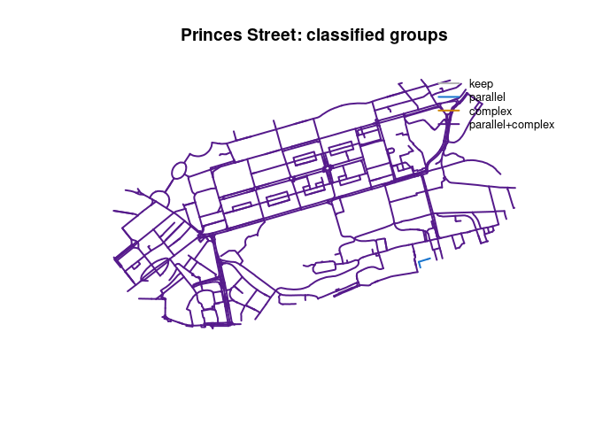

<!-- README.md is generated from README.Rmd. Please edit that file -->

# neatnet

<!-- badges: start -->

<!-- badges: end -->

The goal of neatnet is to provide a high-performance R implementation
for network simplification, combining the “best of” approaches from the
Python `neatnet` and `parenx` packages. It uses the `geos` library for
efficient geometry operations.

## Installation

You can install the development version of neatnet from GitHub:

``` r
# install.packages("remotes")
remotes::install_github("robinlovelace/neatnet")
```

## Example

This is a basic example showing how to simplify two close parallel lines
into a single centerline (skeleton).

``` r
library(sf)
#> Linking to GEOS 3.12.1, GDAL 3.8.4, PROJ 9.3.1; sf_use_s2() is TRUE
library(geos)
# In development, you might source the functions directly if the package isn't installed:
# source("R/neatnet.R")
# Or assume it is installed:
# library(neatnet)
devtools::load_all()
#> ℹ Loading neatnet

# Create a simple test case: two parallel lines 5m apart
l1 <- matrix(c(0, 0, 100, 0), ncol = 2, byrow = TRUE)
l2 <- matrix(c(0, 5, 100, 5), ncol = 2, byrow = TRUE)

lines_sf <- st_sf(
  id = 1:2,
  geometry = st_sfc(st_linestring(l1), st_linestring(l2)),
  crs = 27700 # British National Grid (projected, meters)
)

print(lines_sf)
#> Simple feature collection with 2 features and 1 field
#> Geometry type: LINESTRING
#> Dimension:     XY
#> Bounding box:  xmin: 0 ymin: 0 xmax: 100 ymax: 5
#> Projected CRS: OSGB36 / British National Grid
#>   id                geometry
#> 1  1 LINESTRING (0 0, 100 0)
#> 2  2 LINESTRING (0 5, 100 5)

# Run neatnet with default parameters
# dist = 5 (buffer radius). Since lines are 5m apart, they will merge.
simplified <- neatnet(lines_sf, dist = 5)

print(simplified)
#> Simple feature collection with 1 feature and 0 fields
#> Geometry type: LINESTRING
#> Dimension:     XY
#> Bounding box:  xmin: 0 ymin: 0 xmax: 100 ymax: 5
#> Projected CRS: OSGB36 / British National Grid
#>                                x
#> 1 LINESTRING (100 5, 100 0, 9...

# Plotting (basic)
plot(st_geometry(lines_sf), col = "blue", lwd = 2, main = "Original (Blue) vs Simplified (Red)")
plot(st_geometry(simplified), col = "red", lwd = 2, add = TRUE)
```


## Real-world Example (Princes Street, Edinburgh)

This example uses a real-world dataset from the `parenx` package
(Princes Street, Edinburgh).

### Python (`parenx`)

The equivalent Python code using `parenx` would be:

``` python
import geopandas as gp
from parenx import skeletonize_frame

CRS = "EPSG:27700"
filepath = "rnet_princes_street.geojson"
frame = gp.read_file(filepath).to_crs(CRS)

# buffer=8 corresponds to roughly 16m width
parameter = {"simplify": 0.0, "buffer": 8.0, "scale": 1.0, "knot": False, "segment": False}
r = skeletonize_frame(frame["geometry"], parameter)
```

### R (`neatnet`)

``` r
# Load data included in the package
f <- system.file("extdata", "rnet_princes_street.geojson", package = "neatnet")
princes_st <- st_read(f, quiet = TRUE)
princes_st <- st_transform(princes_st, 27700)

print(paste("Original features:", nrow(princes_st)))
#> [1] "Original features: 1144"

# Run neatnet
# Keep `simplify = FALSE` for now.
simplified_princes <- neatnet(princes_st)
print(paste("Simplified features:", nrow(simplified_princes)))
#> [1] "Simplified features: 795"

# Plot
plot(st_geometry(princes_st), col = "grey", lwd = 3, main = "Princes Street: Original (Grey) vs Simplified (Red)")
plot(st_geometry(simplified_princes), col = "red", lwd = 2, add = TRUE)
```


``` r
mapview::mapview(princes_st, lwd = 4) +
  mapview::mapview(simplified_princes, col.regions = "red", lwd = 2)
library(tmap)
tmap_mode("view")
tm_shape(princes_st) +
  tm_lines(col = "darkgrey", lwd = 4) +
  tm_shape(simplified_princes) +
  tm_lines(col = "red", lwd = 2)
```

``` r
# Classify and visualise groups
groups <- neatnet_classify_groups(
  princes_st,
  parallel_tol_deg = 20,
  complex_min_neighbors = 8,
  complex_min_disp_deg = 60
)

cat("n groups:", length(unique(groups$group_id)), "\n")
#> n groups: 554
print(table(groups$group_class))
#> 
#>          complex             keep         parallel parallel+complex 
#>               18              425              250              451

pal <- c(
  keep = "grey70",
  parallel = "dodgerblue3",
  complex = "orange3",
  `parallel+complex` = "purple4"
)
cols <- pal[as.character(groups$group_class)]
cols[is.na(cols)] <- "grey70"

plot(st_geometry(groups), col = cols, lwd = 2, main = "Princes Street: classified groups")
legend(
  "topright",
  legend = names(pal),
  col = unname(pal),
  lwd = 2,
  cex = 0.8,
  bty = "n"
)
```



``` r
mapview::mapview(groups, zcol = "group_class", lwd = 3, legend = TRUE)
library(tmap)
tmap_mode("view")
tm_shape(groups) +
  tm_lines(col = "group_class", palette = c(
    keep = "grey70",
    parallel = "dodgerblue3",
    complex = "orange3",
    `parallel+complex` = "purple4"
  ), lwd = 3) 
```

``` r
# Network summaries (features, total length, connected components)

input_summary <- net_summary(princes_st, grid_size = 0.1)
output_summary <- net_summary(simplified_princes, grid_size = 0.1)

print(input_summary)
#> $n_features
#> [1] 1144
#> 
#> $n_vertices
#> [1] 4603
#> 
#> $total_length
#> [1] 49375.87
#> 
#> $n_components
#> [1] 2
#> 
#> $n_features_topo
#> [1] 1192
#> 
#> $n_vertices_topo
#> [1] 4670
print(output_summary)
#> $n_features
#> [1] 795
#> 
#> $n_vertices
#> [1] 11657
#> 
#> $total_length
#> [1] 74226.11
#> 
#> $n_components
#> [1] 2
#> 
#> $n_features_topo
#> [1] 3543
#> 
#> $n_vertices_topo
#> [1] 10406
```

``` r
# How neatnet arguments affect connectivity

variants <- list(
  default = neatnet(princes_st),
  dist6 = neatnet(princes_st, dist = 6),
  dist10 = neatnet(princes_st, dist = 10),
  less_pruning = neatnet(princes_st, final_min_factor = 1),
  more_pruning = neatnet(princes_st, final_min_factor = 4),
  finer_boundary = neatnet(princes_st, max_segment_factor = 1.5, final_min_factor = 1),
  coarser_boundary = neatnet(princes_st, max_segment_factor = 3, final_min_factor = 3)
)

variant_summaries <- lapply(variants, net_summary, grid_size = 0.1)
print(variant_summaries)
#> $default
#> $default$n_features
#> [1] 795
#> 
#> $default$n_vertices
#> [1] 11657
#> 
#> $default$total_length
#> [1] 74226.11
#> 
#> $default$n_components
#> [1] 2
#> 
#> $default$n_features_topo
#> [1] 3543
#> 
#> $default$n_vertices_topo
#> [1] 10406
#> 
#> 
#> $dist6
#> $dist6$n_features
#> [1] 954
#> 
#> $dist6$n_vertices
#> [1] 9402
#> 
#> $dist6$total_length
#> [1] 54130.5
#> 
#> $dist6$n_components
#> [1] 2
#> 
#> $dist6$n_features_topo
#> [1] 2302
#> 
#> $dist6$n_vertices_topo
#> [1] 9109
#> 
#> 
#> $dist10
#> $dist10$n_features
#> [1] 795
#> 
#> $dist10$n_vertices
#> [1] 11657
#> 
#> $dist10$total_length
#> [1] 74226.11
#> 
#> $dist10$n_components
#> [1] 2
#> 
#> $dist10$n_features_topo
#> [1] 3543
#> 
#> $dist10$n_vertices_topo
#> [1] 10406
#> 
#> 
#> $less_pruning
#> $less_pruning$n_features
#> [1] 1815
#> 
#> $less_pruning$n_vertices
#> [1] 22124
#> 
#> $less_pruning$total_length
#> [1] 136464.9
#> 
#> $less_pruning$n_components
#> [1] 1
#> 
#> $less_pruning$n_features_topo
#> [1] 5685
#> 
#> $less_pruning$n_vertices_topo
#> [1] 14451
#> 
#> 
#> $more_pruning
#> $more_pruning$n_features
#> [1] 784
#> 
#> $more_pruning$n_vertices
#> [1] 11467
#> 
#> $more_pruning$total_length
#> [1] 73075.12
#> 
#> $more_pruning$n_components
#> [1] 4
#> 
#> $more_pruning$n_features_topo
#> [1] 3477
#> 
#> $more_pruning$n_vertices_topo
#> [1] 10216
#> 
#> 
#> $finer_boundary
#> $finer_boundary$n_features
#> [1] 2030
#> 
#> $finer_boundary$n_vertices
#> [1] 23586
#> 
#> $finer_boundary$total_length
#> [1] 142406.8
#> 
#> $finer_boundary$n_components
#> [1] 1
#> 
#> $finer_boundary$n_features_topo
#> [1] 5959
#> 
#> $finer_boundary$n_vertices_topo
#> [1] 15236
#> 
#> 
#> $coarser_boundary
#> $coarser_boundary$n_features
#> [1] 797
#> 
#> $coarser_boundary$n_vertices
#> [1] 11578
#> 
#> $coarser_boundary$total_length
#> [1] 74255.73
#> 
#> $coarser_boundary$n_components
#> [1] 4
#> 
#> $coarser_boundary$n_features_topo
#> [1] 3524
#> 
#> $coarser_boundary$n_vertices_topo
#> [1] 10272
```
