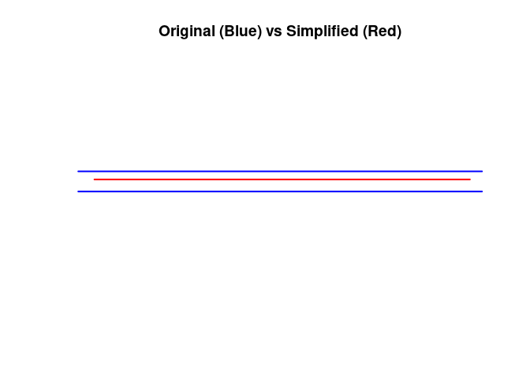
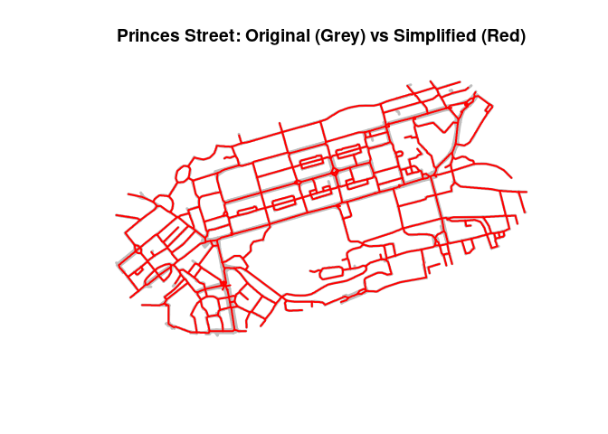
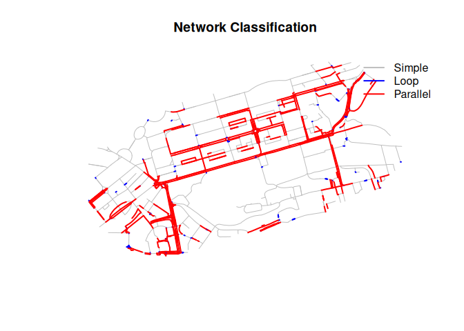

<!-- README.md is generated from README.Rmd. Please edit that file -->

# neatnet

<!-- badges: start -->
<!-- badges: end -->

The goal of neatnet is to provide a high-performance R implementation
for network simplification, combining the “best of” approaches from the
Python `neatnet` and `parenx` packages. It uses the `geos` library for
efficient geometry operations.

## Installation

You can install the development version of neatnet from GitHub:

``` r
# install.packages("remotes")
remotes::install_github("robinlovelace/neatnet")
```

## Example

This is a basic example showing how to simplify two close parallel lines
into a single centerline (skeleton).

``` r
library(sf)
#> Linking to GEOS 3.12.1, GDAL 3.8.4, PROJ 9.4.0; sf_use_s2() is TRUE
library(geos)
# In development, you might source the functions directly if the package isn't installed:
# source("R/neatnet.R") 
# Or assume it is installed:
# library(neatnet)
devtools::load_all()
#> ℹ Loading neatnet

# Create a simple test case: two parallel lines 5m apart
l1 <- matrix(c(0, 0, 100, 0), ncol = 2, byrow = TRUE)
l2 <- matrix(c(0, 5, 100, 5), ncol = 2, byrow = TRUE)

lines_sf <- st_sf(
  id = 1:2,
  geometry = st_sfc(st_linestring(l1), st_linestring(l2)),
  crs = 27700 # British National Grid (projected, meters)
)

print(lines_sf)
#> Simple feature collection with 2 features and 1 field
#> Geometry type: LINESTRING
#> Dimension:     XY
#> Bounding box:  xmin: 0 ymin: 0 xmax: 100 ymax: 5
#> Projected CRS: OSGB36 / British National Grid
#>   id                geometry
#> 1  1 LINESTRING (0 0, 100 0)
#> 2  2 LINESTRING (0 5, 100 5)

# Run neatnet with default parameters
# dist = 5 (buffer radius). Since lines are 5m apart, they will merge.
simplified <- neatnet(lines_sf, dist = 5)

print(simplified)
#> Simple feature collection with 1 feature and 0 fields
#> Geometry type: LINESTRING
#> Dimension:     XY
#> Bounding box:  xmin: 4 ymin: 3 xmax: 96 ymax: 3
#> Projected CRS: OSGB36 / British National Grid
#>                         geometry
#> 1 LINESTRING (96 3, 95 3, 93 ...

# Plotting (basic)
plot(st_geometry(lines_sf), col = "blue", lwd = 2, main = "Original (Blue) vs Simplified (Red)")
plot(st_geometry(simplified), col = "red", lwd = 2, add = TRUE)
```



## Real-world Example (Princes Street, Edinburgh)

This example uses a real-world dataset from the `parenx` package
(Princes Street, Edinburgh).

### Python (`parenx`)

The equivalent Python code using `parenx` would be:

``` python
import geopandas as gp
from parenx import skeletonize_frame

CRS = "EPSG:27700"
filepath = "rnet_princes_street.geojson"
frame = gp.read_file(filepath).to_crs(CRS)

# buffer=8 corresponds to roughly 16m width
parameter = {"simplify": 0.0, "buffer": 8.0, "scale": 1.0, "knot": False, "segment": False}
r = skeletonize_frame(frame["geometry"], parameter)
```

### R (`neatnet`)

``` r
# Load data included in the package
f <- system.file("extdata", "rnet_princes_street.geojson", package = "neatnet")
princes_st <- st_read(f, quiet = TRUE)
princes_st <- st_transform(princes_st, 27700)

print(paste("Original features:", nrow(princes_st)))
#> [1] "Original features: 1144"

# Run neatnet
# dist = 8 matches the Python buffer=8.0
simplified_princes <- neatnet(princes_st, dist = 8)
print(paste("Simplified features:", nrow(simplified_princes)))
#> [1] "Simplified features: 742"

# Plot
plot(st_geometry(princes_st), col = "grey", lwd = 3, main = "Princes Street: Original (Grey) vs Simplified (Red)")
plot(st_geometry(simplified_princes), col = "red", lwd = 2, add = TRUE)
```



## Network Classification (Graph-Based)

The `classify_network()` function uses a graph-theoretic approach to
identify:

- **Loops**: Edges internal to complex intersections (start and end at
  the same node cluster)
- **Parallel**: Multiple edges connecting the same pair of node clusters
  (dual carriageways)
- **Simple**: Unique connections that should be preserved as-is

``` r
# Classify the network using Frechet distance for parallel detection
classified = classify_network(princes_st, dist = 10)

# Summary of classifications
table(classified$net_type)
#> 
#>     loop parallel   simple 
#>      263      417      464

# Visualize: Loops (blue), Parallel (red), Simple (gray)
plot(st_geometry(classified), col = "gray", lwd = 1, 
     main = "Network Classification")
plot(st_geometry(classified[classified$net_type == "loop", ]), 
     col = "blue", lwd = 2, add = TRUE)
plot(st_geometry(classified[classified$net_type == "parallel", ]), 
     col = "red", lwd = 2, add = TRUE)
legend("topright", legend = c("Simple", "Loop", "Parallel"),
       col = c("gray", "blue", "red"), lwd = 2, bty = "n")
```



## Network Simplification

The `simplify_network()` function uses the classification to:

- **Remove** loop edges (internal to complex intersections)
- **Merge** parallel groups into single centerlines using
  skeletonization
- **Keep** simple edges unchanged

``` r
# Simplify the network
simplified_new = simplify_network(princes_st, dist = 10)

cat("Original features:", nrow(princes_st), "\n")
#> Original features: 1144
cat("Simplified features:", nrow(simplified_new), "\n")
#> Simplified features: 771
cat("Reduction:", round((1 - nrow(simplified_new)/nrow(princes_st)) * 100, 1), "%\n")
#> Reduction: 32.6 %

# Compare lengths
cat("\nLength comparison:\n")
#> 
#> Length comparison:
cat("Original:", round(sum(st_length(princes_st))/1000, 1), "km\n")
#> Original: 49.4 km
cat("Simplified:", round(sum(st_length(simplified_new))/1000, 1), "km\n")
#> Simplified: 38.5 km

# Visualize
plot(st_geometry(princes_st), col = "grey", lwd = 3, 
     main = "Simplified Network (Red) vs Original (Grey)")
plot(st_geometry(simplified_new), col = "red", lwd = 2, add = TRUE)
```


``` r
# Network summaries (features, total length, connected components)

input_summary <- net_summary(princes_st, grid_size = 0.1)
output_summary <- net_summary(simplified_princes, grid_size = 0.1)

print(input_summary)
#> $n_features
#> [1] 1192
#> 
#> $total_length
#> [1] 49375.87
#> 
#> $n_components
#> [1] 2
print(output_summary)
#> $n_features
#> [1] 742
#> 
#> $total_length
#> [1] 37233.65
#> 
#> $n_components
#> [1] 2
```

``` r
# How neatnet arguments affect connectivity

variants <- list(
  default = neatnet(princes_st, dist = 8),
  dist4 = neatnet(princes_st, dist = 4),
  dist6 = neatnet(princes_st, dist = 6),
  dist10 = neatnet(princes_st, dist = 10),
  dist12 = neatnet(princes_st, dist = 12),

  prune1 = neatnet(princes_st, dist = 8, final_min_factor = 1),
  prune2 = neatnet(princes_st, dist = 8, final_min_factor = 2),
  less_pruning = neatnet(princes_st, dist = 8, final_min_factor = 1),
  more_pruning = neatnet(princes_st, dist = 8, final_min_factor = 4),

  boundary1_5 = neatnet(princes_st, dist = 8, max_segment_factor = 1.5, final_min_factor = 3),
  finer_boundary = neatnet(princes_st, dist = 8, max_segment_factor = 1.5, final_min_factor = 1),
  boundary2_5 = neatnet(princes_st, dist = 8, max_segment_factor = 2.5, final_min_factor = 3),
  coarser_boundary = neatnet(princes_st, dist = 8, max_segment_factor = 3, final_min_factor = 3)
)

variant_summaries <- lapply(variants, net_summary, grid_size = 0.1)
print(variant_summaries)
#> $default
#> $default$n_features
#> [1] 742
#> 
#> $default$total_length
#> [1] 37233.65
#> 
#> $default$n_components
#> [1] 2
#> 
#> 
#> $dist4
#> $dist4$n_features
#> [1] 964
#> 
#> $dist4$total_length
#> [1] 43994.89
#> 
#> $dist4$n_components
#> [1] 2
#> 
#> 
#> $dist6
#> $dist6$n_features
#> [1] 816
#> 
#> $dist6$total_length
#> [1] 39414.71
#> 
#> $dist6$n_components
#> [1] 2
#> 
#> 
#> $dist10
#> $dist10$n_features
#> [1] 720
#> 
#> $dist10$total_length
#> [1] 36371.02
#> 
#> $dist10$n_components
#> [1] 1
#> 
#> 
#> $dist12
#> $dist12$n_features
#> [1] 697
#> 
#> $dist12$total_length
#> [1] 35029.96
#> 
#> $dist12$n_components
#> [1] 1
#> 
#> 
#> $prune1
#> $prune1$n_features
#> [1] 2433
#> 
#> $prune1$total_length
#> [1] 50429.74
#> 
#> $prune1$n_components
#> [1] 2
#> 
#> 
#> $prune2
#> $prune2$n_features
#> [1] 1164
#> 
#> $prune2$total_length
#> [1] 41382.17
#> 
#> $prune2$n_components
#> [1] 2
#> 
#> 
#> $less_pruning
#> $less_pruning$n_features
#> [1] 2433
#> 
#> $less_pruning$total_length
#> [1] 50429.74
#> 
#> $less_pruning$n_components
#> [1] 2
#> 
#> 
#> $more_pruning
#> $more_pruning$n_features
#> [1] 726
#> 
#> $more_pruning$total_length
#> [1] 36994.96
#> 
#> $more_pruning$n_components
#> [1] 2
#> 
#> 
#> $boundary1_5
#> $boundary1_5$n_features
#> [1] 847
#> 
#> $boundary1_5$total_length
#> [1] 37711.85
#> 
#> $boundary1_5$n_components
#> [1] 2
#> 
#> 
#> $finer_boundary
#> $finer_boundary$n_features
#> [1] 2800
#> 
#> $finer_boundary$total_length
#> [1] 53237.6
#> 
#> $finer_boundary$n_components
#> [1] 2
#> 
#> 
#> $boundary2_5
#> $boundary2_5$n_features
#> [1] 724
#> 
#> $boundary2_5$total_length
#> [1] 37313.9
#> 
#> $boundary2_5$n_components
#> [1] 2
#> 
#> 
#> $coarser_boundary
#> $coarser_boundary$n_features
#> [1] 680
#> 
#> $coarser_boundary$total_length
#> [1] 36956.17
#> 
#> $coarser_boundary$n_components
#> [1] 5
```
