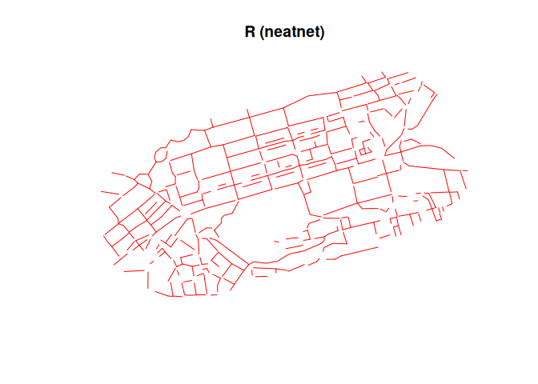
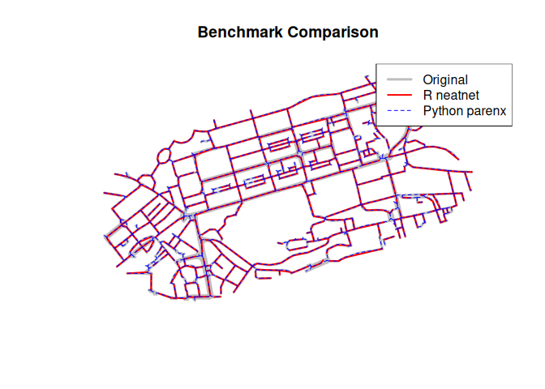

# Benchmark


## Setup

``` r
library(sf)
```

    Linking to GEOS 3.12.1, GDAL 3.8.4, PROJ 9.4.0; sf_use_s2() is TRUE

``` r
library(neatnet)
library(reticulate)
# Ensure reticulate uses the venv we set up
use_virtualenv("./venv", required = TRUE)
```

## Data

``` r
f <- system.file("extdata", "rnet_princes_street.geojson", package = "neatnet")
# Fallback if system.file doesn't find it (during render)
if (f == "") f <- "inst/extdata/rnet_princes_street.geojson"

princes_st <- st_read(f, quiet = TRUE)
princes_st <- st_transform(princes_st, 27700)
print(paste("Original features:", nrow(princes_st)))
```

    [1] "Original features: 1144"

## R Implementation (neatnet)

``` r
t_r <- system.time({
  r_res <- neatnet(princes_st, dist = 8)
})
print(t_r)
```

       user  system elapsed 
      3.955   0.034   3.990 

``` r
print(paste("R features:", nrow(r_res)))
```

    [1] "R features: 407"

``` r
plot(st_geometry(r_res), col = "red", main = "R (neatnet)")
```



## Python Implementation (parenx)

``` python
import sys
import os
import time
import geopandas as gp

# Add parenx source to path
sys.path.insert(0, os.path.abspath("repos/parenx/src"))

from parenx.skeletonize import skeletonize_frame

CRS = "EPSG:27700"
# Locate file
filepath = "inst/extdata/rnet_princes_street.geojson"
if not os.path.exists(filepath):
    # Try finding it in package install if needed, but for now assume local repo structure
    pass

frame = gp.read_file(filepath).to_crs(CRS)

parameter = {"simplify": 0.0, "buffer": 8.0, "scale": 1.0, "knot": False, "segment": False}

start = time.time()
r_py = skeletonize_frame(frame["geometry"], parameter)
end = time.time()
print(f"Time: {end - start}")
```

    Time: 1.7821390628814697

``` python
# Convert GeoSeries to GeoDataFrame if needed for reticulate conversion
if isinstance(r_py, gp.GeoSeries):
    r_py = gp.GeoDataFrame(geometry=r_py)
    
print(f"Features: {len(r_py)}")
```

    Features: 547

## Comparison

``` r
# Load Python result into R
# reticulate converts GeoDataFrame to data.frame with geometry list/column?
# Usually st_as_sf handles it if it comes as a spatial object, or we might need to parse WKT/WKB.
# Reticulate conversion of GeoDataFrame is experimental.
# Let's assume we can get it or read it from file if we save it.

# Safer: save to file in python, read in R
```

``` python
r_py.to_file("benchmark_parenx.geojson", driver="GeoJSON")
```

``` r
py_res <- st_read("benchmark_parenx.geojson", quiet = TRUE)
py_res <- st_transform(py_res, 27700)

# Compare feature counts
print(paste("Original:", nrow(princes_st)))
```

    [1] "Original: 1144"

``` r
print(paste("R neatnet:", nrow(r_res)))
```

    [1] "R neatnet: 407"

``` r
print(paste("Python parenx:", nrow(py_res)))
```

    [1] "Python parenx: 547"

``` r
# Plot comparison
plot(st_geometry(princes_st), col = "grey", lwd = 3, main = "Benchmark Comparison")
plot(st_geometry(r_res), col = "red", add = TRUE, lwd = 2)
plot(st_geometry(py_res), col = "blue", add = TRUE, lwd = 1, lty = 2)
legend("topright", legend = c("Original", "R neatnet", "Python parenx"), col = c("grey", "red", "blue"), lwd = c(3, 2, 1), lty = c(1, 1, 2))
```


